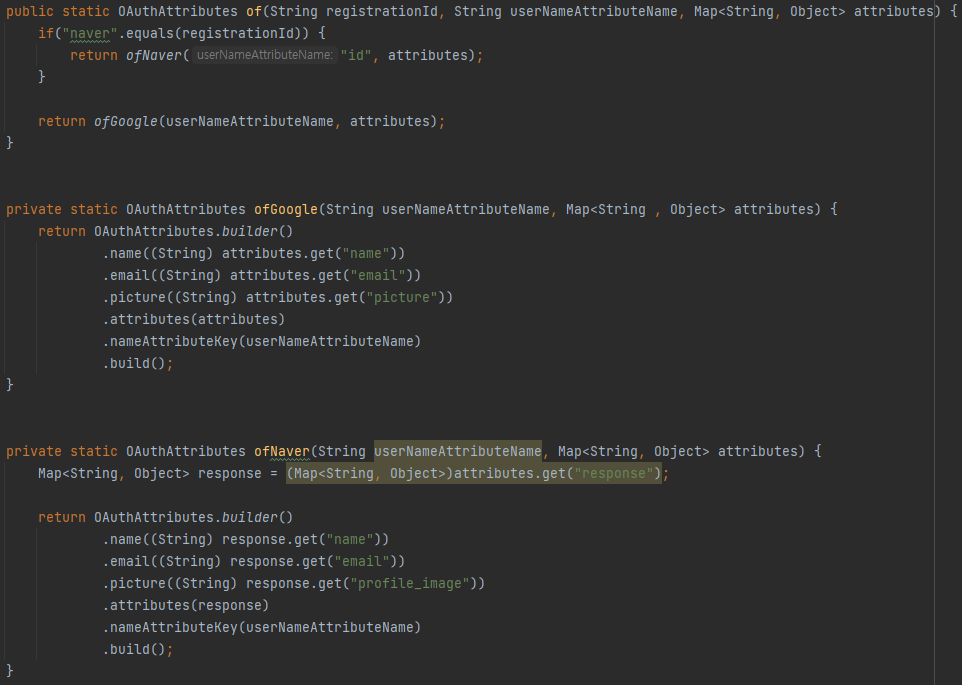

## 정적 팩토리 메소드는 디자인 패턴의 팩토리 패턴과 다르다.

-   정적 팩토리 메소드는 대상 클래스 내부에 `of` 와 같은 메소드를 이용해 구현된다.
    
-   이는 생성자를 대신하기 때문에 자기 자신에 해당하는 인스턴스를 반환한다.
    
-   하지만 팩토리 패턴은 추상화된 객체를 반환한다.
    
-   아래는 정적 팩토리 메소드의 예시이다.
    
    
    
-   `google` 로그인과 `naver`로그인은 같은 `OAuthAttributes` 자신을 반환하지만 각 변수에 들어가는 데이터가 다르기 때문에 인스턴스화를 시키는 부분에서 분기를 하는 것이 아닌 정적 팩토리 메소드를 이용해 서로 상이한 데이터를 가진 객체를 반환한다.
    
-   팩토리 패턴의 사용예는 아래와 같다.
    
    ```java
    public interface Shape {
        public void draw();
    }
    
    public class Circle implements Shape{
        @Override
        public void draw() {
            return;
        }
    }
    
    public class Rectangle implements Shape{
        @Override
        public void draw() {
            return;
        }
    }
    
    public class Square implements Shape{
        @Override
        public void draw() {
            return;
        }
    }
    
    public class ShapeFactory {
        public Shape getShape(String shapeType) {
            switch (shapeType) {
                case "CIRCLE":
                    return new Circle();
                case "RECTANGLE":
                    return new Rectangle();
                case "SQUARE":
                    return new Square();
                default:
                    return null;
            }
        }
    }
    ```
    
-   `Shape` 를 상속받는 각 클래스 중 특정한 인스턴스를 생성하기 위해 `ShapeFactory`클래스를 이용한다.
    

## 정적 팩토리 메소드의 장점

1.  이름을 가질 수 있다.
    
    1.  위의 예제에 작성된 것 처럼 `of` 라는 명칭을 이용하여 인스턴스를 생성하였다.
    2.  이와 같이 해당 메소드를 통해 생성하려는 인스턴스의 목적을 명시할 수 있다.
2.  호출될 때마다 인스턴스를 새로 생성하지는 않아도 된다.
    
    1.  인스턴스를 미리 만들어 놓거나 재사용이 가능한 경우 인스턴스를 캐싱하여 불필요한 객체 생성을 피할 수 있다.
    2.  인스턴스 통제가 가능하다.
    3.  인스턴스 통제를 통해 클래스를 싱글턴으로도 인스턴스화 불가로도 만들 수 있다.
3.  반환 타입의 하위 타입 객체를 반환할 수 있는 능력이 있다.
    
    1.  요 부분은 예시가 더 필요할 것 같은데 아마 위의 팩토리패턴의 그것과 비슷한 느낌이라 생각이 든다.
        
    2.  다른 사람이 공부한 내용에 적어놓은 예시이다.
        
        ```java
        private PaymentService kakaoPaymentService;
        private PaymentService naverPaymentService;
        private PaymentService paycoPaymentService;
        private PaymentService rocketPaymentService;
        
        public PaymentService getType(PaymentType payentType) {
          case KAKAO: return kakaoPaymentService;
          case NAVER: return naverPaymentService;
          case PAYCO: return paycoPaymentService;
          case ROCKET: return rocketPaymentService;
          default: throw new IllegalArgumentException();
        }
        ```
        
    3.  정확히 해당 내용이 맞는지 교차검증이 불가능하지만 이는 팩토리 패턴과 같아보인다.
        
    4.  아래의 예제가 보다 정확해 보인다.
        
        ```java
        class Laptop {
            public static Laptop lowQualityLaptop() {
                return new LowQualityLaptop();
            }
        
            public static Laptop normalLaptop() {
                return new NormalLaptop();
            }
        
            public static Laptop highEndLaptop() {
                return new HighEndLaptop();
            }
        }
        
        class LowQualityLaptop extends Laptop {
            // ...
        }
        
        class NormalLaptop extends Laptop {
            // ...
        }
        
        class HighEndLaptop extends Laptop {
            // ...
        }
        ```
        
    5.  상위 클래스에서 정적 팩토리 메소드를 이용하여 하위 클래스의 인스턴스를 반환한다.
        
    6.  팩토리 패턴과 같이 인스턴스 생성을 위한 별도의 클래스를 생성하는 것이 자버8 이전의 방법인 것 같다.
        
4.  입력 매개변수에 따라 매번 다른 클래스의 객체를 반환할 수 있다.
    
    1.  3번의 예제 두개를 합치면 해당 내용을 정리할 수 있을 것 같다.
        
    2.  하위 클래스를 반환할 수 있는 상위 클래스의 정적 팩토리 메소드가 매개변수를 통해 특정 하위 클래스를 반환하도록 한다.
        
        ```java
        class Laptop {
            public static Laptop getLaptop(int quality) {
        				swtich(quality) {
        						case 1:
        								return new LowQualityLaptop();
        						case 2:
        								return new NormalQualityLaptop();
        						case 3:
        								return new HighQualityLaptop();
        						default:
        								// ...
            }
        }
        
        class LowQualityLaptop extends Laptop {
            // ...
        }
        
        class NormalLaptop extends Laptop {
            // ...
        }
        
        class HighEndLaptop extends Laptop {
            // ...
        }
        ```
        
5.  정적 팩터리 메서드를 작성하는 시점에는 반환할 객체의 클래스가 존재하지 않아도 된다.
    
    1.  대표적인 예로 `JDBC`가 있다고 한다.
    2.  `DriverManager.registerDriver()` 메서드로 각 `DBMS`별 `Driver`를 설정한다. (`제공자 등록 API`)
    3.  `DriverManager.getConnection()` 메서드로 `DB` 커넥션 객체를 받는다. (`service access API`)
    4.  `Connection Interface`는 `DBMS` 별로 동작을 구현하여 사용할 수 있다. (`service Interface`)
    5.  다른 DB가 나오더라도 같은 인터페이스를 이용해 사용이 가능하다고 한다.
    6.  하지만 이는 다형성의 장점이 아닌가?

## 정적 팩토리 메소드의 단점

1.  정적 팩토리 메소드만 제공하면 하위 클래스를 만들 수 없다.
    1.  상속을 위해선 `public` , `protected` 생성자가 필요하다.
    2.  인스턴스 통제 클래스를 만들기 위해선 임의로 `new`를 이용한 생성을 막아야 하기 때문에 생성자를 `private`로 정의할 필요가 있다.
    3.  하지만 `private`생성자는 상속이 불가능하다.
    4.  이 제약은 상속보다 컴포지션을 사용하도록 유도하고 불변 타입으로 만들기 위해 해당 제약을 지켜야 한다는 점에서 장점으로 볼 수도 있다고 한다.
    5.  추후 공부가 더 필요해 보인다.
2.  정적 팩토리 메소드는 프로그래머가 찾기 어렵다.
    1.  생성자와 같이 API설명에 명확히 들어나지 않아 사용자는 정적 팩토리 메소드 방식 클래스를 인스턴스화할 방법을 알아내야 한다.
    2.  주로 사용되는 명명방식은 아래와 같다.
        1.  `from`: 매개변수를 하나 받아서 해당 타입의 인스턴스를 반환하는 형변환 메소드
        2.  `to`: 여러 매개변수를 받아 적합한 타입의 인스턴스를 반환하는 집계 메소드
        3.  `valueOf`: `from`과 `of`의 더 자세한 버전
        4.  `instance` , `getInstance`: 매개변수로 명시한 인스턴스를 반환하지만 같은 인스턴스임을 보장하지 않는다.
        5.  `create`, `newInstance`: `instance` , `getInstance`와 같지만 매번 새로운 인스턴스를 반환함을 보장한다.
        6.  `getType`: `getInstance`와 같으나 생성할 클래스가 아닌 다른 클래스에 팩토리 메서드를 정의할 때 사용한다.
        7.  `newType`: `newInstance`와 같으나 생성할 클래스가 아닌 다른 클래스에 팩토리 메소드를 정의할 때 사용하한다.
        8.  `type`: `getType`, `newType`의 간결한 버전